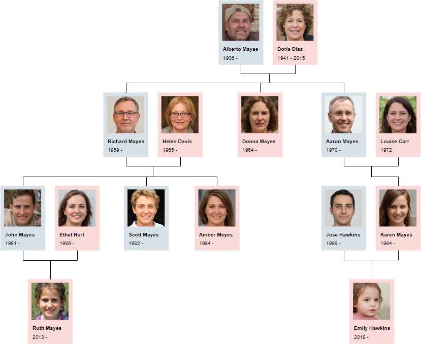

## Лабораторная работа №1

<ins>Задание:</ins>
Составить базу знаний на языке Пролог, которая будет содержать генеалогическое
дерево семьи с указанием родственных отношений (например, папа, бабушка и т.д.), опираясь на два
первичных факта: родитель и супруг. 

<ins>Генеалогического дерево:</ins>

